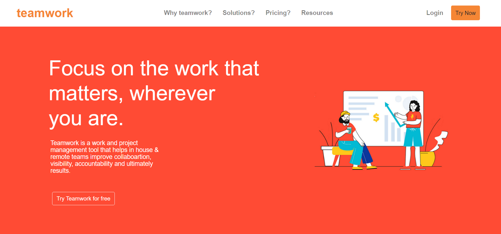

[![Contributors][contributors-shield]][contributors-url]
[![Forks][forks-shield]][forks-url]
[![Stargazers][stars-shield]][stars-url]
[![Issues][issues-shield]][issues-url]
[![MIT License][license-shield]][license-url]

<p>
  <a href="https://www.ruby-lang.org/en/">
    
  </a>
</p>

### TeamWork

A project management tool for remote teams in an organization. Providing the future fuctionalities of chats and virtual meetings scheduling.

## Table of Contents

- [User Features](#user-features)
- [Built With](#built-with)
- [Technologies Employed](#technologies-employed)
- [Live Preview](#live-preview)
- [Required Installations](#required-installations)
- [App Installation](#instalation)
- [Future Features](#future-features)
- [License](#license)
- [Author](#author)
- [Acknowledgements](#acknowledgements)

<!-- User features -->

## User Features

- A user can log in to the app and have their login credentials saved on the back-end.
- The user can have a live chat session with other team members.
- The user schedule a meeting with other team members and save the details of the meeting on the cloud.

## The app will consist of four pages:

* Homepage
* Meetings
* Chats
* Calendar


<!-- BUILT WITH -->

# Built With

- VsCode
- Windows

<!-- TECHNOLOGIES EMPLOYED -->

# Technologies Employed

- Firebase
- React Hooks
- React Routers
- Styled Components
- Jest auto watch

<!-- LIVE PREVIEW -->

## Live Preview

- Here is a link to the live frontend version of the app - https://teamswork.netlify.app/

  <!-- REQUIRED INSTALLATION -->

## Required Installations

- npm v5.2+

<!-- INSTALLATION -->

## Installation of This Repository

Clone the Repository,

```Shell
your@pc:~$ git clone https://github.com/mikenath223/teamwork.git
```

Go to the downloaded folder

```Shell
your@pc:~$ cd teamwork/
```

Install all packages

```Shell
your@pc:~$ npm install
```

Start the server

```Shell
your@pc:~$ npm start
```

The app will open on your local host port 3000.

<!-- run tests -->

## Run tests

Run all tests

```Shell
your@pc:~$ npm test
```

Run specific tests

```Shell
your@pc:~$ npm test src/**/<testfile>
```

<!-- Future features -->

## Future Features

- Working on the backend to integrate with the frontend.

## Learn More

You can learn more in the [Create React App documentation](https://facebook.github.io/create-react-app/docs/getting-started).

To learn React, check out the [React documentation](https://reactjs.org/).

# Author

**Michgolden Ukeje**

- Github: [@mikenath223](https://github.com/mikenath223)
- Twitter: [@Michgolden_Nath](https://twitter.com/MichgoldenU)
- Linkedin: [Ukeje Michgolden](https://https://www.linkedin.com/in/michgoldenukeje/)
  <br />

# License

This project is licensed under the MIT License - see the [LICENSE.md](LICENSE.md) file for details

<!-- ACKNOWLEDGEMENTS -->

## Acknowledgements

- [Microverse](https://www.microverse.org/)
- [The Odin Project](https://www.theodinproject.com/)

<!-- MARKDOWN LINKS & IMAGES -->
<!-- https://www.markdownguide.org/basic-syntax/#reference-style-links -->

[contributors-shield]: https://img.shields.io/github/contributors/mikenath223/teamwork.svg?style=flat-square
[contributors-url]: https://github.com/mikenath223/teamwork/graphs/contributors
[forks-shield]: https://img.shields.io/github/forks/mikenath223/teamwork
[forks-url]: https://github.com/mikenath223/teamwork/network/members
[stars-shield]: https://img.shields.io/github/stars/mikenath223/teamwork
[stars-url]: https://github.com/mikenath223/teamwork/stargazers
[issues-shield]: https://img.shields.io/github/issues/mikenath223/teamwork
[issues-url]: https://github.com/mikenath223/teamwork/issues
[license-shield]: https://img.shields.io/github/license/mikenath223/teamwork
[license-url]: https://github.com/mikenath223/teamwork/blob/master/LICENSE.txt
